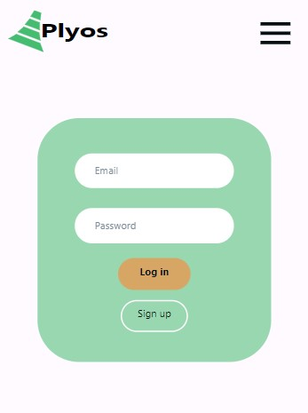

# Plyos-web-applicatie

De plyos webapplicatie helpt hockeytrainers en -coaches zich optimaal voor te bereiden voor de trainingen met hun team. Op site kunnen zij door middel van verschillende blogpost en oefeningen inspiratie opdoen. Geregistreerde gebruikers kunnen hiernaast trainingen aanmaken. In zo'n training kunnen zijn oefeningen samenvoegen. 

### Homepage

### Training

### Login

### Blog

### Exercise

## Benodigheden
Naast een editor en een terminal zijn er slechts één benodigdheid vereist om met dit project aan de slag te kunnen. Download en installeer NodeJS, volg de instructies op de [website](https://nodejs.org/en/). 

## Installatie
Nadat het project van Github is gecloned naar een lokale map, is er slechts één stap nodig voordat het gestart kan worden:  
npm install. Hiermee worden de dependencies geinstalleerd.

## Gebruikers
Om in te loggen kan in de webapplicatie een nieuwe gebruiker worden aangemaakt. Tevens kan gebruik worden gemaakt van een aantal testgebruikers:  
Email: gebruiker1@test.nl    -      Wachtwoord: 1234Qwer  
Email: gebruiker2@test.nl    -      Wachtwoord: 1234Qwer  
Email: gebruiker3@test.nl    -      Wachtwoord: 1234Qwer  

## Beschikbare scripts
In dit project zijn vier scripts standaard beschikbaar. Deze zullen hieronder toegelicht worden.

### `npm start`
Met dit script wordt het project gestart. Er wordt een browser geopend, wijzigingen in het project worden hierin direct opnieuw geladen. 

### `npm build`
Met dit commando wordt er een build-directory aangemaakt met daarin een productie 'build' van de applicatie. 

### `npm test`
Dit script voert de in het project beschreven testen uit. Op deze manier kan getest worden of bestanden doen wat er verwacht wordt. 

### `npm eject`
Met dit commando kan zichtbaar gemaakt worden welke bestanden door React onder de moterkap geïnstalleerd zijn, maar nu niet zichtbaar zijn in package.json. Hiermee kun je meer controle krijgen over de dingen die React standaard voor je afhandeld (Webpack, Babel, ect.). Als dit commando eenmaal gebruikt is , kan men niet meer terug. 

